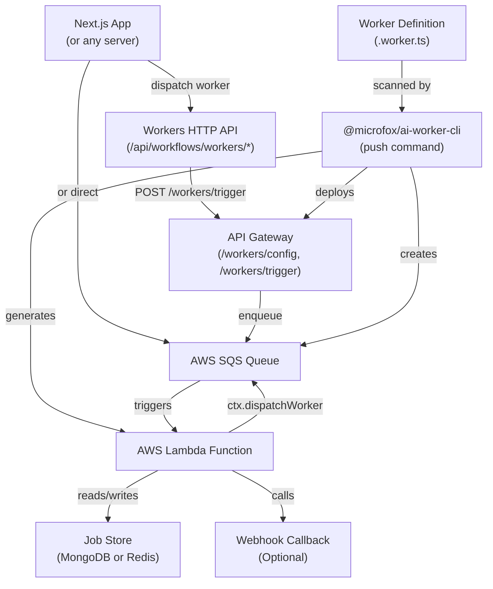

## Overview

The worker system consists of two main packages:

- **`@microfox/ai-worker`** - Runtime library for defining and executing workers
- **`@microfox/ai-worker-cli`** - Deployment tooling for AWS Lambda

Together, they enable durable, scalable background job execution with worker-to-worker communication, job state management, and seamless local/production execution.

## High-Level Architecture



## Component Breakdown

### 1. Worker Definition Layer

Workers are defined as TypeScript files using `createWorker`:

```typescript
import { createWorker, type WorkerConfig } from '@microfox/ai-worker';
import { z } from 'zod';

export const workerConfig: WorkerConfig = {
  timeout: 900,
  memorySize: 2048,
};

export default createWorker({
  id: 'video-processor',
  inputSchema: z.object({ url: z.string() }),
  outputSchema: z.object({ processedUrl: z.string() }),
  handler: async ({ input, ctx }) => {
    // Worker logic
  },
});
```

**Key aspects:**

- **Type-safe**: Uses Zod schemas for input/output validation
- **Configurable**: `workerConfig` controls Lambda deployment settings
- **Context-aware**: `ctx` provides job store, dispatch capabilities, and metadata

### 2. Dispatch Layer

The dispatch layer handles job submission:

**Local Mode (Development):**
- Executes handler immediately in same process
- Uses direct DB access for job store (if available)
- Falls back to HTTP calls if DB not accessible
- Perfect for fast iteration and debugging

**Remote Mode (Production):**
- Sends message to SQS queue (or HTTP trigger to API Gateway)
- Queue triggers Lambda function
- Lambda executes handler asynchronously
- Job state persisted in MongoDB or Redis

**Dispatch flow:**

```typescript
// From Next.js app or another worker
const result = await worker.dispatch(
  { url: 'https://example.com/video.mp4' },
  {
    webhookUrl: 'https://myapp.com/api/callback',
    mode: 'auto', // 'local' | 'remote' | 'auto'
    metadata: { userId: '123' },
  }
);
```

### 3. Queue Layer (SQS)

Each worker gets its own SQS queue:

**Queue Configuration:**
- **Visibility Timeout**: Worker timeout + 60s buffer
- **Message Retention**: Configurable (default: 14 days)
- **Dead Letter Queue**: Created automatically if `maxReceiveCount` > 1
- **Batch Size**: 1 (one message per Lambda invocation)

**Message Format:**

```json
{
  "workerId": "video-processor",
  "jobId": "job-1234567890-abc",
  "input": { "url": "https://example.com/video.mp4" },
  "context": { "requestId": "req-123" },
  "webhookUrl": "https://myapp.com/api/callback",
  "metadata": { "userId": "123" },
  "timestamp": "2024-01-01T00:00:00Z"
}
```

### 4. Lambda Execution Layer

Lambda functions are generated by the CLI:

**Handler structure:** The CLI generates a Lambda entrypoint that imports `createLambdaHandler` from `@microfox/ai-worker/handler`, imports your worker module, and exports a handler that wraps `worker.handler` and `worker.outputSchema`.

**Execution Flow:**

1. **Receive SQS event** - Lambda triggered by queue message
2. **Parse message** - Extract worker ID, job ID, input, context
3. **Initialize job store** - Connect to MongoDB
4. **Create handler context** - Build `ctx` with job store, dispatch capabilities
5. **Execute handler** - Run user-defined worker logic
6. **Update job state** - Persist status, output, or errors
7. **Send webhook** - Call callback URL if provided
8. **Handle errors** - Update job status, send to DLQ if needed

### 5. Job Store Layer

Job state is persisted in MongoDB or Upstash Redis:

**Job Document Structure (MongoDB):**

```typescript
{
  _id: ObjectId,
  jobId: "job-1234567890-abc",
  workerId: "video-processor",
  status: "completed", // "queued" | "running" | "completed" | "failed"
  input: { url: "https://example.com/video.mp4" },
  output: { processedUrl: "https://cdn.example.com/processed.mp4" },
  metadata: { userId: "123" },
  internalJobs: [
    { jobId: "job-child-1", workerId: "thumbnail-generator" }
  ],
  createdAt: ISODate("2024-01-01T00:00:00Z"),
  updatedAt: ISODate("2024-01-01T00:05:00Z"),
  completedAt: ISODate("2024-01-01T00:05:00Z")
}
```

**Job Store Interface:**

```typescript
interface JobStore {
  update(update: JobStoreUpdate): Promise<void>;
  get(): Promise<JobRecord | null>;
  appendInternalJob?(entry: { jobId: string; workerId: string }): Promise<void>;
  getJob?(jobId: string): Promise<JobRecord | null>;
}
```

**Backend Options:**

- **MongoDB**: Document-based storage with collections (`worker_jobs`, `queue_jobs`)
- **Upstash Redis**: Hash-based storage with TTL and key prefixes (`worker:jobs:`, `worker:queue-jobs:`)

**Operations:**

- **Create**: Initial job record (status: "queued")
- **Update**: Status transitions, progress updates, output storage
- **Get**: Retrieve current job state
- **Append Internal Job**: Track child workers (worker-to-worker)
- **Get Job**: Poll child job status (for await mode)

**Configuration:** Set `WORKER_DATABASE_TYPE` to `'mongodb'` or `'upstash-redis'` in `microfox.config.ts` or environment variables.

### 6. Worker-to-Worker Communication

Workers can dispatch other workers:

**Fire-and-Forget:**

```typescript
// Parent worker
handler: async ({ ctx }) => {
  await ctx.dispatchWorker('thumbnail-generator', { videoId: '123' });
  // Continues immediately, doesn't wait
}
```

**Await Mode:**

```typescript
// Parent worker
handler: async ({ ctx }) => {
  const result = await ctx.dispatchWorker(
    'thumbnail-generator',
    { videoId: '123' },
    { await: true }
  );
  // Waits for child to complete
  console.log(result.output); // Child worker output
}
```

**Implementation:**

- **Local**: Uses HTTP trigger (`WORKER_BASE_URL`)
- **Lambda**: Uses SQS queue (via `WORKER_QUEUE_URL_<ID>` env var)
- **Tracking**: Child jobs appended to parent's `internalJobs` array
- **Polling**: In await mode, polls job store until child completes

**CLI Detection:**

The CLI scans handler code for `ctx.dispatchWorker('worker-id', ...)` patterns and injects queue URL environment variables:

```typescript
// CLI detects this pattern:
await ctx.dispatchWorker('thumbnail-generator', input);

// Injects into Lambda environment:
WORKER_QUEUE_URL_THUMBNAIL_GENERATOR=https://sqs.us-east-1.amazonaws.com/...
```

### Worker queues architecture

A **worker queue** is a fixed sequence of workers (e.g. step A → step B → step C). The runtime chains them automatically: you dispatch the queue once, and each step runs after the previous one completes.

**Flow:**

1. **Dispatch** – Your app (or a cron) POSTs to the queue-start API (or uses `dispatchQueue(queueId, initialInput, options)`). Pass the **first worker’s input** directly. The queue-start handler creates the **queue job** record in the same MongoDB/Redis store, so progress is visible via `GET /api/workflows/queues/:queueId/:id`.
2. **First step** – The first worker in the queue is triggered with the initial input. The job input includes reserved **queue context** (`__workerQueue`: `queueId`, `stepIndex`, `queueJobId`, `initialInput`).
3. **Queue-aware wrapper** – When the worker handler completes, the runtime (wrapper around your handler) reads the queue context, looks up the next step from the registry, maps input from the previous step’s output if configured, and calls `ctx.dispatchWorker(next.workerId, nextInput)`. That enqueues the next worker; when it runs, it receives the same queue context with an incremented `stepIndex`.
4. **Last step** – When the last worker completes, the queue job is updated to completed (or partial/failed if a step failed). No extra orchestration code is required in your app.

**Queue job store:** One record per queue run, with a `steps` array (each step: `workerId`, `workerJobId`, `status`, `input`, `output`, `error`, timestamps). Same backend as worker jobs (MongoDB `queue_jobs` collection or Redis key prefix `worker:queue-jobs:`). Created automatically by the **queue-start handler** (Lambda) before enqueuing the first worker.

**Defining queues:** Use `.queue.ts` files with `defineWorkerQueue({ id, steps: [{ workerId }, ...], schedule? })` or provide queue definitions via the workers config API. The CLI scans queues and generates queue-starter Lambdas when `schedule` is set.

### 7. CLI Deployment Layer

The CLI (`@microfox/ai-worker-cli`) handles deployment:

**Scanning Phase:**

1. **Find workers**: Glob pattern `app/ai/**/*.worker.ts`
2. **Find queues**: Glob pattern `app/ai/**/*.queue.ts`
3. **Extract configs**: Parse `workerConfig` exports
4. **Analyze dependencies**: Walk import graph
5. **Detect env vars**: Scan for `process.env.*`
6. **Detect worker calls**: Find `ctx.dispatchWorker` patterns

**Generation Phase:**

1. **Handler files**: Generate Lambda entrypoints
2. **Queue handlers**: Generate queue starter/step handlers
3. **Serverless config**: Generate `serverless.yml`
4. **Build config**: Configure esbuild bundling

**Build Phase:**

1. **Bundle handlers**: Use esbuild to compile TypeScript
2. **External deps**: Exclude node_modules (use Lambda layers or install)
3. **Output**: Write to `.serverless-workers/dist/`

**Deploy Phase:**

1. **Package**: Create deployment package
2. **Deploy**: Run `serverless deploy`
3. **Create resources**: SQS queues, Lambda functions, IAM roles
4. **Update configs**: Environment variables, event sources

## Data Flow Examples

### Example 1: Simple Worker Dispatch

```
1. Next.js app calls worker.dispatch()
   ↓
2. Message sent to SQS queue
   ↓
3. SQS triggers Lambda function
   ↓
4. Lambda executes handler
   ↓
5. Handler updates job store (status: "running")
   ↓
6. Handler processes data
   ↓
7. Handler updates job store (status: "completed", output: {...})
   ↓
8. Lambda sends webhook callback (if configured)
```

### Example 2: Worker-to-Worker (Await)

```
1. Parent worker calls ctx.dispatchWorker(..., { await: true })
   ↓
2. Child job enqueued to child's SQS queue
   ↓
3. Parent's internalJobs updated: [{ jobId: "child-123", workerId: "child" }]
   ↓
4. Parent polls job store: getJob("child-123")
   ↓
5. Child Lambda executes, updates job store
   ↓
6. Parent sees status: "completed", extracts output
   ↓
7. Parent continues execution with child's output
```

### Example 3: Queue Chain

```
1. Queue starter Lambda triggered by schedule
   ↓
2. Dispatches first worker in queue
   ↓
3. First worker completes, updates queue job step
   ↓
4. Queue runtime detects completion, dispatches next worker
   ↓
5. Next worker receives previous worker's output as input
   ↓
6. Process repeats until all steps complete
```

## Error Handling

### Lambda-Level Errors

**Handler throws error:**
1. Lambda catches exception
2. Job store updated: `status: "failed", error: {...}`
3. Message sent to Dead Letter Queue (if maxReceiveCount exceeded)
4. Webhook called with error status (if configured)

**SQS retry behavior:**
- Message becomes visible again after visibility timeout
- Lambda retries (up to `maxReceiveCount` times)
- After max retries, message goes to DLQ

### Job Store Errors

**Database connection failure (MongoDB or Redis):**
- Handler continues execution
- Job updates logged but not persisted
- Webhook still called (if configured)
- Consider using retry logic or fallback storage

### Webhook Errors

**Webhook call fails:**
- Error logged but doesn't affect job execution
- Job state still persisted in MongoDB
- Consider retry logic or webhook queue

## Performance Considerations

### Lambda Cold Starts

**Mitigation:**
- Use provisioned concurrency for critical workers
- Keep handler code minimal (defer heavy imports)
- Use Lambda layers for large dependencies

### SQS Throughput

**Scaling:**
- SQS automatically scales to handle high throughput
- Lambda concurrency limits control parallel executions
- Use batch processing for high-volume workers

### Job Store Performance

**Optimization:**
- **MongoDB**: Index `jobId` field for fast lookups, use connection pooling
- **Redis**: Hash-based lookups are O(1), use TTL to auto-expire old jobs
- Redis is faster for high-frequency polling (await mode) due to lower latency

## Security Considerations

### Authentication

**SQS Access:**
- Lambda execution role has SQS permissions
- Queue policies restrict access to authorized roles

**Webhook Security:**
- Use HTTPS for webhook URLs
- Validate webhook signatures (if supported)
- Use API keys or tokens for authentication

### Data Privacy

**Sensitive Data:**
- Don't log sensitive input/output
- Use AWS Secrets Manager for credentials
- Encrypt job store data at rest

### Resource Isolation

**Multi-tenant:**
- Use separate queues per tenant (if needed)
- Isolate job store collections
- Use IAM policies for access control

## Monitoring and Observability

### CloudWatch Metrics

**Lambda metrics:**
- Invocations, errors, duration, throttles
- Set up alarms for error rates

**SQS metrics:**
- Messages sent, received, deleted
- Approximate age of oldest message
- Dead letter queue depth

### Job Store Metrics

**Custom metrics:**
- Job completion rate
- Average job duration
- Worker-to-worker call counts
- Queue depth per worker

### Logging

**Structured logging:**
- Include `jobId`, `workerId` in all logs
- Use correlation IDs for tracing
- Log job state transitions

## Best Practices

1. **Idempotency**: Make handlers idempotent (safe to retry)
2. **Timeouts**: Set appropriate Lambda timeouts (max 15 minutes)
3. **Memory**: Right-size Lambda memory (affects CPU allocation)
4. **Error handling**: Always update job status on errors
5. **Progress updates**: Use `jobStore.update({ progress })` for long-running jobs
6. **Worker-to-worker**: Prefer fire-and-forget unless you need output
7. **Testing**: Test locally with `mode: 'local'` before deploying
8. **Monitoring**: Set up CloudWatch alarms for error rates
9. **Documentation**: Document worker inputs/outputs in Zod schemas
10. **Versioning**: Use stages (dev/stage/prod) for safe deployments

## Application Integration

To use workers in your application, you need the boilerplate infrastructure: job store, worker registry, and HTTP routes for workers and queues.

### Recommended: CLI boilerplate

Run the CLI to generate these files in your app:

```bash
npx ai-worker boilerplate
# or: npx @microfox/ai-worker-cli boilerplate
```

Options:
- `--force` – Overwrite existing files
- `--app-dir <path>` – App directory path (default: `app`)
- `--skip-config` – Skip microfox.config.ts updates

This creates:

- **Stores** – Job store interface and adapters (MongoDB, Redis), plus queue job store
- **Registry** – Worker registry that uses the GET /workers/config API
- **Workers API** – Routes for trigger, job status, webhook, and job updates
- **Queues API** – Routes for triggering queues, listing and getting queue jobs, step updates, and webhook
- **Config** – Merges `workflowSettings.jobStore` into `microfox.config.ts` if present

See the [CLI reference](../api-reference/ai-worker-cli#boilerplate) for full details. For a runnable example that references the repository, see [Workers + Orchestration Proof](../examples/workers-orchestration-proof).

### Required Configuration

After setting up the boilerplate, configure your job store:

1. **Set job store type** in `microfox.config.ts`:
   ```typescript
   workflowSettings: {
     jobStore: {
       type: 'mongodb' | 'upstash-redis',
       // ...connection settings
     }
   }
   ```

2. **Set environment variables**:
   - **MongoDB**: `MONGODB_URI` or `DATABASE_MONGODB_URI`, `MONGODB_DB`, `MONGODB_WORKER_JOBS_COLLECTION`
   - **Redis**: `WORKER_UPSTASH_REDIS_REST_URL`, `WORKER_UPSTASH_REDIS_REST_TOKEN`, `WORKER_UPSTASH_REDIS_JOBS_PREFIX`

3. **Deploy workers** (optional, for production):
   ```bash
   npx ai-worker push --stage prod   # build and deploy; use npx microfox push for deploy only
   ```

4. **Set WORKER_BASE_URL** (if using deployed workers):
   - Point to your deployed API Gateway base URL (e.g., `https://xxx.execute-api.us-east-1.amazonaws.com/prod`)

## Future Enhancements

Potential improvements:

- **EventBridge integration**: More scheduling options
- **X-Ray tracing**: Distributed tracing support
- **Metrics export**: Prometheus/StatsD integration
- **Worker versioning**: Support multiple versions per worker
- **Blue/green deployments**: Zero-downtime deployments
