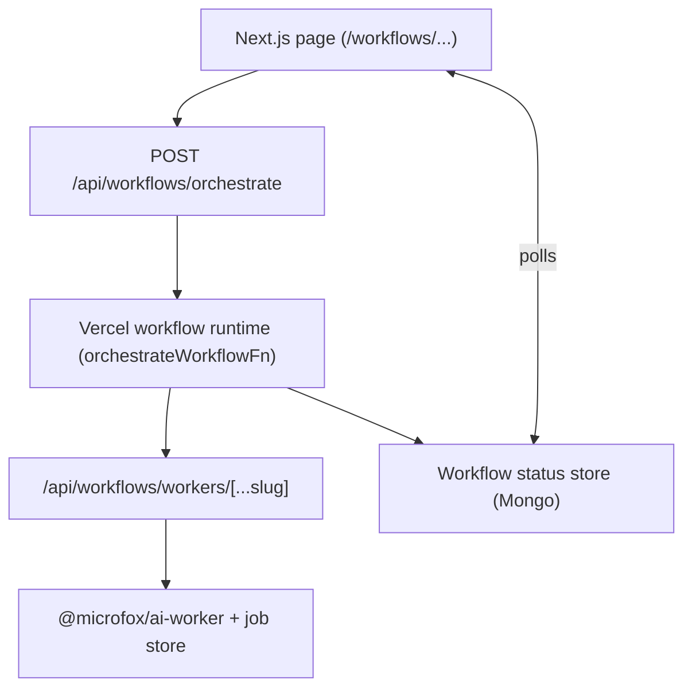

## High-level architecture

A typical integration includes:

- **Orchestration config** from `@microfox/ai-workflow`.
- **Vercel workflow runtime** via `workflow` and the `vercelWorkflowAdapter`.
- **Next.js API routes** under `/api/workflows/*`.
- **Client helpers** (`createOrchestrationClient`, `createWorkflowClient`).



## Config: enabling `workflow` runtime

`next.config.ts` wraps the app with `workflow/next` and ensures the workflow runtime is treated
as a server-only dependency:

```typescript next.config.ts
import type { NextConfig } from 'next';
import { withWorkflow } from 'workflow/next';

const baseConfig: NextConfig = {
  serverExternalPackages: [
    'workflow',
    '@workflow/core',
    '@workflow/world-local',
    'undici',
  ],
  eslint: { ignoreDuringBuilds: true },
  typescript: { ignoreBuildErrors: true },
  webpack: (config, { isServer, webpack }) => {
    if (!isServer) {
      config.plugins = config.plugins || [];
      config.plugins.push(
        new webpack.IgnorePlugin({ resourceRegExp: /^workflow\/api$/ }),
        new webpack.IgnorePlugin({ resourceRegExp: /^workflow$/ }),
        new webpack.IgnorePlugin({ resourceRegExp: /^@workflow\// }),
        new webpack.IgnorePlugin({ resourceRegExp: /^undici$/ }),
      );
    }
    return config;
  },
};

const nextConfig = withWorkflow(baseConfig);
export default nextConfig;
```

## Orchestration endpoint

The main entrypoint for starting workflows is:

- `POST /api/workflows/orchestrate`

It:

1. Validates and prepares an `OrchestrationConfig`.
2. Persists debug metadata.
3. Starts a Vercel workflow using `orchestrateWorkflowFn`.
4. Seeds the **workflow status store** with a record keyed by `runId`.

```typescript
import { start } from 'workflow/api';
import { orchestrateWorkflowFn } from '../workflows/orchestrateWorkflow';
import type { OrchestrationConfig } from '@microfox/ai-workflow';
import { prepareOrchestrationConfig } from '@microfox/ai-workflow';
import { workflowStatusStore } from '../stores/workflowStatusStore';

export async function POST(req: NextRequest) {
  const body = await req.json();
  const { config: rawConfig, executionId, hookTokens, messages, input } = body;

  const workflowConfig = prepareOrchestrationConfig(rawConfig as OrchestrationConfig);
  const baseUrl = req.nextUrl.origin;

  const orchestrationConfig: OrchestrationConfig = {
    ...workflowConfig,
    id: rawConfig.id ?? 'workflow',
    input: {
      ...(input ?? workflowConfig.input ?? {}),
      workflowId: rawConfig.id ?? 'workflow',
      executionId,
      hookTokens: hookTokens ?? {},
    },
    messages: messages ?? workflowConfig.messages ?? [],
  };

  const run = await start(orchestrateWorkflowFn, [
    {
      config: orchestrationConfig,
      baseUrl: `${baseUrl}/api/studio/chat/agent`,
      workerTriggerBaseUrl: process.env.WORKER_BASE_URL /* ... */,
    },
  ]);

  await workflowStatusStore.create({
    runId: run.runId,
    status: await run.status,
    executionId,
    metadata: { workflowId: orchestrationConfig.id },
  });

  return NextResponse.json({ runId: run.runId, status: await run.status });
}
```

## Status and HITL endpoints

The orchestration API surface (simplified):

- `GET /api/workflows/orchestrate/:runId` – read status from the status store.
- `POST /api/workflows/orchestrate/:runId/update` – internal status updates from the runtime.
- `POST /api/workflows/orchestrate/signal` – resume a **hook** (HITL) by token.
- `GET /api/workflows/orchestrate/run-id/:executionId` – map `executionId` → `runId`.

The example executor (`orchestrateWorkflowFn`) calls `updateWorkflowStatus` step functions to
keep the status store in sync as the workflow progresses.

## Worker endpoints

Workers are exposed via a generic route:

- `POST /api/workflows/workers/:workerId` – trigger a worker (optionally with `await`).
- `GET /api/workflows/workers/:workerId/:jobId` – job status.
- `POST /api/workflows/workers/:workerId/webhook` – completion callback for push-style flows.

```typescript
import { dispatchWorker } from '@microfox/ai-worker';

export async function POST(
  req: NextRequest,
  { params }: { params: Promise<{ slug: string[] }> },
) {
  const { slug: slugParam } = await params;
  const [workerId, action] = slugParam || [];

  if (action === 'webhook') return handleWebhook(req, workerId);
  if (action === 'update') return handleJobUpdate(req, workerId);
  if (action === 'job') return handleCreateJob(req, workerId);

  const { input, await: shouldAwait = false } = await req.json();
  const webhookBase = process.env.WORKFLOW_WEBHOOK_BASE_URL;
  const webhookUrl =
    shouldAwait && webhookBase
      ? `${webhookBase.replace(/\/+$/, '')}/api/workflows/workers/${workerId}/webhook`
      : undefined;

  const dispatchResult = await dispatchWorker(workerId, (input || {}) as Record<string, unknown>, {
    ...(webhookUrl ? { webhookUrl } : {}),
    metadata: { source: 'workflow-orchestration' },
  });

  return NextResponse.json({
    jobId: dispatchResult.jobId,
    status: 'queued',
  });
}
```

## Client helpers

Use the client helpers from `@microfox/ai-workflow` to call these routes from UI code or
server actions. For **workers and queues** (trigger + poll), use the `useWorkflowJob` hook instead—see [Workers / Client hook](../foundation/workers#client-hook-useworkflowjob).

### Orchestration client

```typescript
import { createOrchestrationClient, prepareOrchestrationConfig } from '@microfox/ai-workflow';

const client = createOrchestrationClient(
  typeof window !== 'undefined' ? window.location.origin : '',
);

const config = prepareOrchestrationConfig(orchestrationConfig);
const executionId = `wf_${Date.now()}_${Math.random().toString(36).slice(2, 9)}`;

const { runId, status } = await client.orchestrate({
  config,
  executionId,
  hookTokens: { gate: 'my-hook-token' },
  input: {},
  messages: [],
});

const statusResult = await client.getWorkflowStatus(runId);
await client.resumeHook({ token: 'my-hook-token', payload: { approved: true } });
```

### Unified workflow client

For the `/api/workflows/*` routes, use `createWorkflowClient`:

```typescript
import { createWorkflowClient } from '@microfox/ai-workflow';

const client = createWorkflowClient(
  typeof window !== 'undefined' ? window.location.origin : '',
);

// Start a config-driven orchestration
const start = await client.startOrchestration(orchestrationConfig, {
  hookTokens: { gate: 'worker-proof:gate:...' },
  input: {},
  messages: [],
});

// Get status from the unified status endpoint
const status = await client.getWorkflowStatus('/orchestrate', start.runId);

// Send HITL signal
await client.sendSignal('/orchestrate', 'worker-proof:gate:...', {
  continued: true,
});
```

The example pages under `/workflows/*` (such as `orchestration-test` and `worker-proof`) use
these helpers to:

- start a workflow with a prepared config,
- poll for status,
- resume hooks from the UI.

See [Workers + Orchestration Proof](../examples/workers-orchestration-proof) for a
complete end‑to‑end example.

