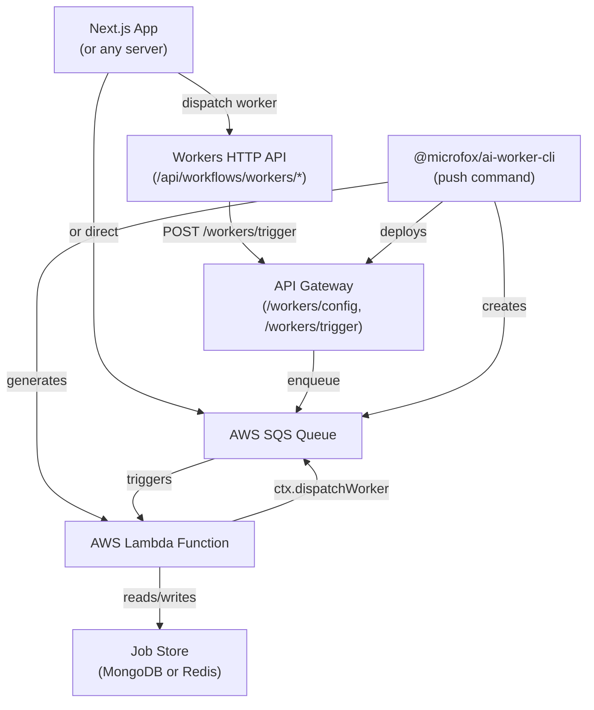

## Why workers?

Workers let you move long-running or non-interactive work **off the request/response path**:

- **Slow or bursty tasks**: data processing, web scraping, report generation.
- **Durable execution**: jobs are persisted in a **job store** (MongoDB or Redis).
- **Scalable**: workers run on AWS Lambda, triggered via SQS queues.

Microfox ships a dedicated runtime, `@microfox/ai-worker`, plus deployment tooling (`@microfox/ai-worker-cli`) and HTTP API routes for your application.

## Architecture



## Defining a worker

Workers are defined with `createWorker` from `@microfox/ai-worker`, using Zod for input/output:

<CodeGroup>

```typescript Echo worker
import { createWorker } from '@microfox/ai-worker';
import { z } from 'zod';

/**
 * Echo Worker
 * Fast, deterministic worker for testing.
 * Returns { echoed, at } for status polling.
 */
export default createWorker({
  id: 'echo',
  inputSchema: z.object({
    message: z.string().describe('Message to echo back'),
  }),
  outputSchema: z.object({
    echoed: z.string(),
    at: z.string(),
  }),
  handler: async ({ input, ctx }) => {
    await ctx.jobStore?.update({ status: 'running' });
    const echoed = String(input.message ?? '');
    const at = new Date().toISOString();
    await ctx.jobStore?.update({
      status: 'completed',
      output: { echoed, at },
    });
    return { echoed, at };
  },
});
```

```typescript Data processor worker
import { createWorker } from '@microfox/ai-worker';
import { z } from 'zod';

/**
 * Data Processor Worker
 * Simulates a long-running data processing task with progress updates.
 */
export default createWorker({
  id: 'data-processor',
  inputSchema: z.object({
    data: z.array(z.any()).describe('Array of data items to process'),
    operation: z
      .enum(['analyze', 'transform', 'validate'])
      .describe('Type of operation to perform'),
    batchSize: z.number().optional().default(10).describe('Number of items per batch'),
  }),
  outputSchema: z.object({
    operation: z.enum(['analyze', 'transform', 'validate']),
    totalItems: z.number(),
    processed: z.number(),
    results: z.array(z.any()),
    summary: z.object({
      success: z.number(),
      failed: z.number(),
      duration: z.string(),
    }),
  }),
  handler: async ({ input, ctx }) => {
    const { data, operation, batchSize = 10 } = input;
    const totalItems = data.length;
    let processed = 0;
    const results: any[] = [];

    await ctx.jobStore?.update({ status: 'running' });

    for (let i = 0; i < data.length; i += batchSize) {
      const batch = data.slice(i, i + batchSize);

      // Simulate processing time (1–3 seconds per batch)
      const processingTime = 1000 + Math.random() * 2000;
      await new Promise((resolve) => setTimeout(resolve, processingTime));

      // Process batch and push to results
      results.push(...batch);
      processed += batch.length;

      // Update progress
      await ctx.jobStore?.update({
        progress: Math.round((processed / totalItems) * 100),
        progressMessage: `Processed ${processed} of ${totalItems} items`,
      });
    }

    await ctx.jobStore?.update({
      status: 'completed',
      output: {
        operation,
        totalItems,
        processed,
        results,
        summary: {
          success: results.length,
          failed: 0,
          duration: `${Math.round(processed * 1.5)}ms (simulated)`,
        },
      },
    });

    return {
      operation,
      totalItems,
      processed,
      results,
      summary: {
        success: results.length,
        failed: 0,
        duration: `${Math.round(processed * 1.5)}ms (simulated)`,
      },
    };
  },
});
```

</CodeGroup>

### Worker handler signature

Under the hood, `createWorker` wraps a **worker handler**:

```typescript
type WorkerHandler<INPUT, OUTPUT> = (args: {
  input: INPUT;
  ctx: {
    jobId: string;
    workerId: string;
    jobStore?: JobStore;
    /** Logger with prefixed levels: [INFO], [WARN], [ERROR], [DEBUG] */
    logger: {
      info(message: string, data?: Record<string, unknown>): void;
      warn(message: string, data?: Record<string, unknown>): void;
      error(message: string, data?: Record<string, unknown>): void;
      debug(message: string, data?: Record<string, unknown>): void;
    };
    dispatchWorker: (workerId: string, input: unknown, options?: DispatchWorkerOptions) => Promise<{ jobId: string; messageId?: string; output?: unknown }>;
  };
}) => Promise<OUTPUT>;
```

- `input` is fully parsed via Zod (defaults applied).
- `ctx.jobStore` lets you update job status, progress, and output.
- `ctx.logger` logs with predefined prefixes: `ctx.logger.info('start')` → `[INFO] [workerId] [jobId] start`; use `warn`, `error`, and `debug` (debug only when `DEBUG` or `WORKER_DEBUG` is set) for consistent worker logs.
- `ctx.dispatchWorker(workerId, input, options?)` lets you call another worker from inside this worker (fire-and-forget or await). See [Worker-to-worker](#worker-to-worker) below.

### Lambda deployment (WorkerConfig)

When you deploy workers with `npx ai-worker push`, the CLI generates Lambda functions and SQS queues from your worker definitions. You can customize each worker’s Lambda and queue behavior by exporting a **`WorkerConfig`** from the same file as the worker.

**Best practice:** Export `workerConfig` as a **separate const** from your worker file. The CLI reads this export when building `serverless.yml`; you do not pass it into `createWorker()`.

```typescript
import { createWorker, type WorkerConfig } from '@microfox/ai-worker';
import { z } from 'zod';

export default createWorker({
  id: 'data-processor',
  inputSchema: z.object({ /* ... */ }),
  outputSchema: z.object({ /* ... */ }),
  handler: async ({ input, ctx }) => { /* ... */ },
});

export const workerConfig: WorkerConfig = {
  timeout: 120,           // Lambda timeout in seconds (max 900)
  memorySize: 512,        // Lambda memory in MB (128–10240)
  layers: ['arn:aws:lambda:${aws:region}:${aws:accountId}:layer:ffmpeg:1'],
  schedule: 'rate(2 hours)',
  sqs: {
    maxReceiveCount: 3,
    messageRetentionPeriod: 1209600,
    visibilityTimeout: 180,
    deadLetterMessageRetentionPeriod: 1209600,
  },
};
```

| Option | Description |
|--------|-------------|
| `timeout` | Lambda timeout in seconds (max 900). |
| `memorySize` | Lambda memory in MB (128–10240). |
| `layers` | Lambda layer ARNs (e.g. for ffmpeg). Supports `${aws:region}`, `${aws:accountId}`. |
| `schedule` | Schedule events: string (`'rate(5 minutes)'`, `'cron(0 12 * * ? *)'`), object with `rate`, `enabled`, `input`, `timezone`, or array of these. |
| `sqs.maxReceiveCount` | Receives before moving to DLQ (default 3). Use 1 to avoid retries. |
| `sqs.messageRetentionPeriod` | Main queue retention in seconds (max 1209600 = 14 days). |
| `sqs.visibilityTimeout` | Main queue visibility timeout (seconds). Default: worker timeout + 60. |
| `sqs.deadLetterMessageRetentionPeriod` | DLQ retention in seconds. |

The CLI merges this config into the generated Serverless Framework resources for that worker.

## Worker-to-worker

From inside a worker's handler you can invoke another worker using `ctx.dispatchWorker`:

```typescript
handler: async ({ input, ctx }) => {
  // Fire-and-forget: enqueue and return immediately
  await ctx.dispatchWorker('other-worker', { key: 'value' });

  // Await: enqueue then poll the job store until the child completes or fails
  const result = await ctx.dispatchWorker('other-worker', { key: 'value' }, { await: true });
  console.log(result.output); // child worker output

  // Fire-and-forget with delay (0–900 seconds; uses SQS DelaySeconds)
  await ctx.dispatchWorker('other-worker', { key: 'value' }, { delaySeconds: 60 });
};
```

- **Fire-and-forget (default)**: Enqueues the child job and returns `{ jobId, messageId }`. The parent job's `internalJobs` is appended with `{ jobId, workerId }` in call order.
- **Delay** (fire-and-forget only): Pass `delaySeconds` (0–900) so the message is delivered after that many seconds. Uses SQS `DelaySeconds` per message; no serverless.yml or EventBridge needed. Ignored when `await: true`.
- **Await** (`options.await: true`): Same enqueue + append, then the runtime polls the job store until the child job is `completed` or `failed`. Resolves with `{ jobId, messageId, output }` or throws if the child failed. Optional `pollIntervalMs` / `pollTimeoutMs` control polling.

**Deploy**: The CLI scans for `ctx.dispatchWorker('worker-id', ...)` and injects `WORKER_QUEUE_URL_<SANITIZED_ID>` into that Lambda's environment so it can send directly to the callee's SQS queue. Same-service workers get queue URLs automatically; for cross-service, set the env var manually.

**Local**: In development, `dispatchWorker` uses the HTTP trigger (`WORKER_BASE_URL`) when queue URL env is not set. The app job store should export `appendInternalJob(parentJobId, entry)` and `getJob(jobId)` for internalJobs and await/polling to work locally.

## Job lifecycle and JobStore

Workers are **durable** because every job is persisted through a `JobStore` abstraction:

- `setJob` – insert or update a job record (queued).
- `updateJob` – patch status, progress, output, or error.
- `getJob` – read job status (used by polling APIs).
- `appendInternalJob` – track child workers (worker-to-worker).

In the examples, the job store is implemented with MongoDB (`mongoAdapter.ts`) or Upstash Redis (`redisAdapter.ts`) and exposed to the API routes that talk to workers.

Job documents support an optional **internalJobs** array: `internalJobs: [{ jobId, workerId }, ...]`, appended in the order that worker calls `ctx.dispatchWorker`. Used for parent/child job tracking.

**Environment variables (Lambda / job store):** `MONGODB_URI` or `DATABASE_MONGODB_URI`, `MONGODB_WORKER_DB` (or `MONGODB_DB`), `MONGODB_WORKER_JOBS_COLLECTION` (default: `worker_jobs`). For Redis: `WORKER_UPSTASH_REDIS_REST_URL`, `WORKER_UPSTASH_REDIS_REST_TOKEN`, `WORKER_UPSTASH_REDIS_JOBS_PREFIX` (default: `worker:jobs:`). For worker-to-worker, each Lambda that calls other workers gets `WORKER_QUEUE_URL_<SANITIZED_WORKER_ID>` (e.g. `WORKER_QUEUE_URL_COST_USAGE_AI`) from the CLI-generated serverless config.

## Application boilerplate

To use workers in your application, you need to set up:

1. **Job store** – MongoDB or Redis adapter for persisting job state
2. **Workers HTTP API** – Routes for triggering workers and polling status
3. **Configuration** – `microfox.config.ts` with `workflowSettings.jobStore`

You have two options:

### Option 1: CLI boilerplate (recommended)

Run the CLI command to create/update these files automatically:

```bash
npx ai-worker boilerplate
# or: npx @microfox/ai-worker-cli boilerplate
```

Options:
- `--force` – Overwrite existing files
- `--app-dir <path>` – App directory path (default: `app`)
- `--skip-config` – Skip microfox.config.ts updates

See the [CLI reference](../api-reference/ai-worker-cli#boilerplate) for details. For a runnable example with repository links, see [Workers + Orchestration Proof](../examples/workers-orchestration-proof).

### Option 2: Manual setup

You can implement the same structure yourself: job store adapters (MongoDB and Redis), workers route (trigger, status, webhook, update, job), and queues route (trigger, list, get, update, webhook). Triggering does not require a registry: workers are triggered by POST to the trigger API (by worker ID), and queues by POST to the queue-start API with first-worker input (the queue-start handler creates the queue job). The [Worker Architecture](../advanced/worker-architecture) doc describes the pieces; the [Workers + Orchestration Proof](../examples/workers-orchestration-proof) example includes direct repository links to reference implementations.

## HTTP API for workers

The workers HTTP API exposes endpoints under `/api/workflows/workers/[...slug]`:

- `POST /api/workflows/workers/:workerId` – **trigger** a worker job (optionally with await).
- `GET /api/workflows/workers/:workerId/:jobId` – **poll** job status.
- `POST /api/workflows/workers/:workerId/webhook` – **webhook** for completion callbacks.
- `POST /api/workflows/workers/:workerId/update` – **update** job status (called by Lambda workers).
- `POST /api/workflows/workers/:workerId/job` – **create** job record before polling.

This API is used by:
- Your application code (server actions, API routes, etc.)
- The deployed workers service (when workers run on Lambda)

When workers are deployed to AWS Lambda, the CLI also creates API Gateway endpoints:
- `GET /workers/config` – Returns worker configuration (queue URLs, etc.)
- `POST /workers/trigger` – Triggers a worker via SQS

## Worker queues (architecture)

A **worker queue** is an ordered pipeline of workers: step 1 runs, then step 2 (with optional input mapping from step 1’s output), and so on. Use queues for multi-stage workflows (e.g. “fetch → transform → notify”) without writing orchestration code yourself.

### How it works

1. **Definition** – Queues are defined in `.queue.ts` files (or via the workers config API) with an `id` and a `steps` array of `{ workerId, delaySeconds?, mapInputFromPrev? }`.
2. **Dispatch** – You POST to the queue-start API (or use `dispatchQueue(queueId, input, options)` from `@microfox/ai-worker`). The **first worker’s input** is passed directly (no mapping for step 0). The queue-start handler creates the queue job record and enqueues the first worker with **queue context** (`__workerQueue`) in the job input.
3. **Chaining** – When the first worker completes, the runtime (queue-aware wrapper) looks up the next step, maps input from the previous output if configured, and calls `ctx.dispatchWorker(next.workerId, nextInput)`. This repeats until the last step finishes.
4. **Queue job store** – A single **queue job** record (same MongoDB/Redis store as worker jobs) tracks the whole run. The **queue-start handler** (Lambda) creates/upserts it before enqueuing the first worker, so you can poll `GET /api/workflows/queues/:queueId/:id` for progress.

### Triggering a queue

**From a client component**, use `useWorkflowJob`:

```tsx
const { trigger, status, output } = useWorkflowJob({
  type: 'queue',
  queueId: 'cost-usage',
  metadata: { source: 'ui' },
});
// trigger({}) to start
```

**From server code** (API routes, server actions, cron), call the queues API or use `dispatchQueue` (no registry required; pass first-worker input directly):

```typescript
// POST /api/billing/aggregates/rollup – trigger the cost-usage queue from server
export async function POST() {
  const baseUrl = process.env.APP_URL || (process.env.VERCEL_URL ? `https://${process.env.VERCEL_URL}` : 'http://localhost:3000');
  const res = await fetch(`${baseUrl}/api/workflows/queues/cost-usage`, {
    method: 'POST',
    headers: { 'Content-Type': 'application/json' },
    body: JSON.stringify({ input: {}, metadata: { source: 'billing-api' } }),
  });
  const data = await res.json();
  if (!res.ok) throw new Error(data.error ?? 'Failed to trigger queue');
  return Response.json({
    jobId: data.jobId,
    queueId: data.queueId,
    queueJobUrl: data.queueJobUrl,
  });
}
```

Or use `dispatchQueue(queueId, input, { metadata, jobId })` from `@microfox/ai-worker` to POST to the queue-start API directly. The **queues API** provides:

- **POST /api/workflows/queues/:queueId** – trigger a queue (body: `input?`, `metadata?`, `jobId?`)
- **GET /api/workflows/queues/:queueId/:jobId** – get queue job status
- **GET /api/workflows/queues** or **GET /api/workflows/queues?queueId=...** – list queue jobs

Optional app logic (e.g. cooldown) can list recent jobs for a queue via the same API or the job store before triggering.

## Dispatching workers

### Client hook (useWorkflowJob) — recommended for UI

In React client components, use the **`useWorkflowJob`** hook (added by the CLI boilerplate to `hooks/useWorkflowJob.ts`) to trigger a worker or queue and poll until completion. It calls your app's workers/queues API (`/api/workflows/workers/*`, `/api/workflows/queues/*`) under the hood.

**Worker:**

```tsx
'use client';

import { useWorkflowJob } from '@/hooks/useWorkflowJob';

export function EchoDemo() {
  const { trigger, jobId, status, output, error, loading, polling, reset } =
    useWorkflowJob({
      type: 'worker',
      workerId: 'echo',
      pollIntervalMs: 2000,
      onComplete: (result) => console.log('Done', result),
    });

  return (
    <div>
      <button onClick={() => trigger({ message: 'Hello' })} disabled={loading}>
        Run echo
      </button>
      {polling && <span>Status: {status}</span>}
      {output && <pre>{JSON.stringify(output, null, 2)}</pre>}
      {error && <span className="text-destructive">{error.message}</span>}
      {jobId && <button onClick={reset}>Reset</button>}
    </div>
  );
}
```

**Queue:**

```tsx
const { trigger, status, output, ... } = useWorkflowJob({
  type: 'queue',
  queueId: 'demo-data-processor',
  metadata: { source: 'ui' },
});
```

**Options (both worker and queue):** `baseUrl`, `pollIntervalMs`, `pollTimeoutMs`, `autoPoll`, `onComplete`, `onError`, `enabled`. **Returned:** `trigger(input?)`, `jobId`, `status` (`idle` | `queued` | `running` | `completed` | `failed` | `partial`), `output`, `error`, `loading`, `polling`, `reset()`.

### From server code

Use `dispatchWorker` from `@microfox/ai-worker` to trigger a worker by ID—no need to import the worker file:

```typescript
import { dispatchWorker } from '@microfox/ai-worker';

const result = await dispatchWorker(
  'echo',
  { message: 'Hello from worker' },
  { metadata: { source: 'example' } }
);
// result: { jobId, messageId, status: 'queued' }
```

For server-side HTTP (API routes, cron, external services), call your app's workers API or the deployed workers service. `WORKER_BASE_URL` is server-side only; client components should use `useWorkflowJob`, which calls your app's `/api/workflows/*` routes.

### From deployed workers service

When your server needs to trigger workers deployed to Lambda, use the API Gateway trigger endpoint:

```typescript
import { getWorkersTriggerUrl } from '@microfox/ai-worker/client';

const triggerUrl = getWorkersTriggerUrl(); // Uses WORKER_BASE_URL env var

const response = await fetch(triggerUrl, {
  method: 'POST',
  headers: {
    'Content-Type': 'application/json',
    'x-workers-trigger-key': process.env.WORKERS_TRIGGER_API_KEY, // optional
  },
  body: JSON.stringify({
    workerId: 'echo',
    body: {
      workerId: 'echo',
      jobId: `job-${Date.now()}-${Math.random().toString(36).slice(2, 11)}`,
      input: { message: 'Hello from worker' },
      context: {},
      metadata: {},
      timestamp: new Date().toISOString(),
    },
  }),
});
```

**Environment variables**: Set `WORKER_BASE_URL` (server-side only) to your deployed workers API base URL (e.g., `https://xxx.execute-api.us-east-1.amazonaws.com/prod`).

## Execution modes

Workers can run in two modes:

### Local mode (development)

In development (`NODE_ENV === 'development'` and `WORKERS_LOCAL_MODE !== 'false'`), `dispatch()` runs handlers immediately in the same process:

- Handlers execute synchronously
- Job store uses direct DB access (if available) or HTTP fallback
- Webhooks are called immediately after completion
- Worker-to-worker uses HTTP trigger (`WORKER_BASE_URL`)

Perfect for fast iteration and debugging.

### Remote mode (production)

In production or when `mode: 'remote'`, `dispatch()` sends messages to SQS which triggers Lambda functions:

- Handlers execute on AWS Lambda
- Job store uses MongoDB or Redis directly
- Webhooks are called from Lambda after completion
- Worker-to-worker uses SQS queues (via `WORKER_QUEUE_URL_*` env vars)

Deploy workers with:

```bash
npx ai-worker push --stage prod
```

See the [CLI reference](../api-reference/ai-worker-cli) for deployment details. Use `npx ai-worker push` for build and deploy; `npx microfox compile` for build only, `npx microfox push` for deploy only.
