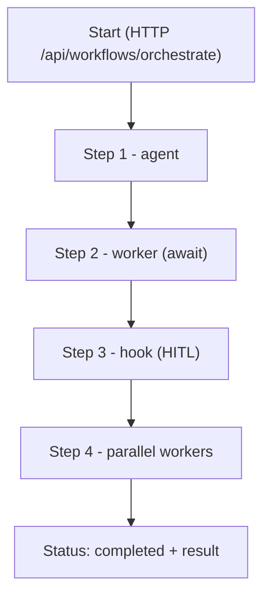

## Overview

Workflows in Microfox are defined as **pure orchestration configs**:

- You describe a sequence (or graph) of **steps**: agents, workers, hooks (HITL), sleeps, conditions, and parallel branches.
- Each step reads from and writes to an **orchestration context**, forming a typed dataflow.
- The config is executed by a **runtime adapter** (e.g. Vercel `workflow` runtime) and surfaced via Next.js API routes.

The core building blocks live in `@microfox/ai-workflow`.

### Key concepts

- **OrchestrationConfig** – the workflow definition (steps, input, messages, options).
- **OrchestrationStep** – a discriminated union of all step types.
- **OrchestrationContext** – the mutable context passed through steps.
- **HITL hooks** – `hook` steps that pause the workflow until resumed by an external signal.
- **Awaited workers** – `worker` steps that can block until a job completes (with polling).

## The OrchestrationConfig

```typescript
export interface OrchestrationConfig {
  /** Optional workflow id for metadata/debug files. */
  id?: string;
  /** Ordered list of steps (agent, worker, hook, sleep, condition, parallel, workflow). */
  steps: OrchestrationStep[];
  /** Base URL for agent calls (used by some runtimes). */
  baseUrl?: string;
  /** Initial messages (e.g. chat history). */
  messages?: any[];
  /** Initial input (available as context.input). */
  input?: any;
  /** Default hook timeout, e.g. '7d'. */
  hookTimeout?: string;
  /** Fail-fast vs continue-on-error for step failures. */
  continueOnError?: boolean;
  /** Global timeout for the entire orchestration, e.g. '30m'. */
  timeout?: string;
  /** Default poll config for awaited worker steps. */
  workerPoll?: WorkerPollConfig;
}
```

## Step types

Every step is tagged via `type` and participates in the `OrchestrationStep` union:

```typescript
export type OrchestrationStep =
  | AgentStep      // Call an ai-router agent
  | HookStep       // Human-in-the-loop gate (HITL)
  | SleepStep      // Pause using workflow.sleep()
  | ConditionStep  // Branching based on context
  | ParallelStep   // Run child steps in parallel
  | WorkerStep     // Trigger / await a worker
  | WorkflowStep   // Call another workflow
  | StatusUpdateStep; // Internal only (auto-injected)
```

### Agent steps

Call any `@microfox/ai-router` agent via HTTP (using the `/api/studio/chat/agent` route in the examples):

```typescript
export interface AgentStep {
  type: 'agent';
  agent: string; // Agent path, e.g. '/system/current_date'
  input?: any | ((ctx: OrchestrationContext) => any);
  await?: boolean; // true = wait for response, false = fire-and-forget
  id?: string;     // Optional ID for referencing output
}
```

### Worker steps

Integrate `@microfox/ai-worker` jobs into orchestration:

```typescript
export interface WorkerStep {
  type: 'worker';
  worker: string; // Worker ID, e.g. 'data-processor'
  input?: any | ((ctx: OrchestrationContext) => any);
  await?: boolean; // true = poll until completion, false = fire-and-forget
  id?: string;
  workerPoll?: WorkerPollConfig; // Per-step poll config (overrides config.workerPoll)
}
```

In the example orchestration runtime (`orchestrateWorkflowFn`), awaited workers are triggered
via a Next.js endpoint and then polled until `status: 'completed'`:

```typescript
case 'worker': {
  const workerInput = step.input !== undefined
    ? resolveInput(step.input, context, step)
    : context.previous || context.input;

  // Dispatch via workerTriggerBaseUrl (e.g. SQS/Lambda + trigger API)
  const dispatchResult = await callWorkerStep({
    workerId: step.worker,
    workerInput,
    workerTriggerBaseUrl,
    awaitMode: step.await === true,
  });

  if (step.await !== true) {
    // Fire-and-forget: return jobId and status
    const output = { jobId: dispatchResult.jobId, status: dispatchResult.status || 'queued' };
    context.steps[step.id!] = output;
    context.previous = output;
    context.all.push(output);
    return output;
  }

  // Awaited: poll until completed using pollWorkerJobStep() + workflow.sleep()
  // ...
}
```

### Hook steps (HITL)

Hook steps pause the workflow and wait for an external **resume** call:

```typescript
export interface HookStep {
  type: 'hook';
  token: string | ((ctx: OrchestrationContext) => string);
  schema?: ZodTypeAny;
  id?: string;
}
```

In the runtime, hook steps are implemented with the `workflow` runtime’s `defineHook`:

```typescript
case 'hook': {
  const hookTokens = (context.input as any)?.hookTokens || {};
  const tokenOverride = step.id ? hookTokens[step.id] : undefined;
  const token = tokenOverride || resolveToken(step.token, context, step);

  // Update status to 'paused' with hook token
  await updateWorkflowStatus({ apiBaseUrl, runId, status: 'paused', hookToken: token });

  const { defineHook } = await import('workflow');
  const { z } = await import('zod');

  const hookSchema = defineHook({
    schema: step.schema || z.any(),
  });

  const hook = hookSchema.create({ token });
  const payload = await hook; // Workflow pauses here until resumed

  const output = { token, payload };
  context.steps[step.id!] = output;
  context.previous = output;
  context.all.push(output);
  return output;
}
```

The `/api/workflows/orchestrate/signal` endpoint resumes hooks using this token.

### Condition and parallel steps

Conditions and parallelism are expressed declaratively:

```typescript
export interface ConditionStep {
  type: 'condition';
  if: boolean | StepFieldCondition | ((ctx: OrchestrationContext) => boolean);
  then: OrchestrationStep[];
  else?: OrchestrationStep[];
}

export interface ParallelStep {
  type: 'parallel';
  steps: OrchestrationStep[];
}
```

- `whenStep()` + `evaluateStepFieldCondition()` help you define **serializable conditions**
  that can be safely passed through JSON.
- `parallel` runs all child steps concurrently and collects results; errors can either
  fail-fast or be collected (depending on `continueOnError`).

## OrchestrationContext

The `OrchestrationContext` tracks inputs, step outputs, and errors:

```typescript
export interface OrchestrationContext {
  input: any;
  steps: Record<string, any>;
  previous: any;
  all: any[];
  runId?: string;
  errors?: Array<{ step: string; error: any }>;
}
```

- `input` – initial payload set in `config.input`.
- `steps[id]` – output of a step with `id`.
- `previous` – output of the last executed step.
- `all` – array of all step outputs in execution order.

The helper `resolveInput()` allows you to **pipe** previous step outputs into later steps:

```typescript
if (input && typeof input === 'object' && Array.isArray((input as any)._fromSteps)) {
  const raw = input as { _fromSteps: string[]; _path?: string; _join?: string };
  const path = raw._path ?? 'content';
  const stepIds = raw._fromSteps;
  const data = stepIds
    .map((id) => {
      const s = context.steps[id];
      if (s == null) return null;
      const v = path ? (s as any)[path] : s;
      return typeof v === 'string' ? v : v != null ? JSON.stringify(v) : null;
    })
    .filter((x): x is string => x != null && x !== '');

  // data: string[] from the selected step outputs
}
```

This is how the **worker-proof** example collects outputs from multiple worker steps to build a
timeline proof.

## High-level flow (diagram)



- The HTTP API takes an `OrchestrationConfig` (from `@microfox/ai-workflow`) and
  starts a Vercel workflow run.
- The runtime executes the steps, updating status via dedicated endpoints.
- Client-side pages poll `/api/workflows/orchestrate/[runId]` to show live status.

See the [Next.js Workflows](../advanced/workflows-nextjs) and
[Workers + Orchestration Proof](../examples/workers-orchestration-proof) docs for
end-to-end wiring.

