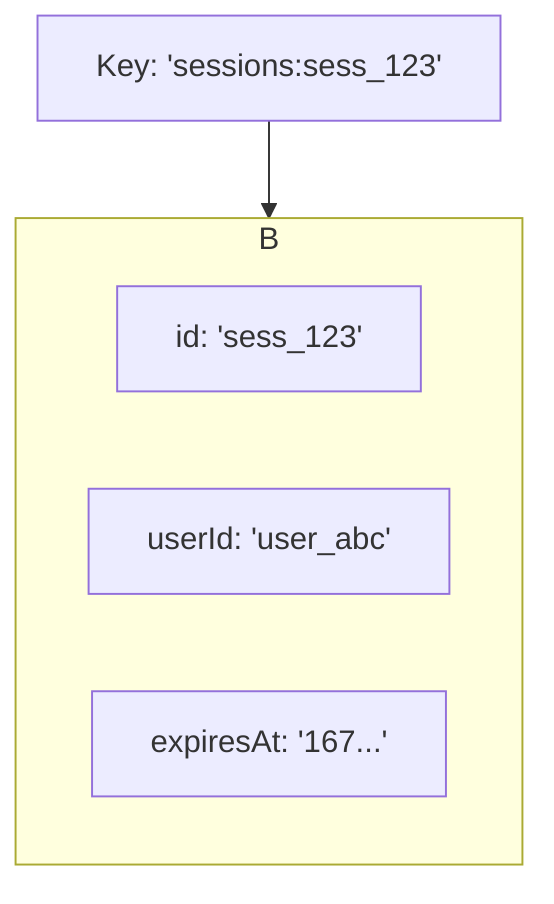
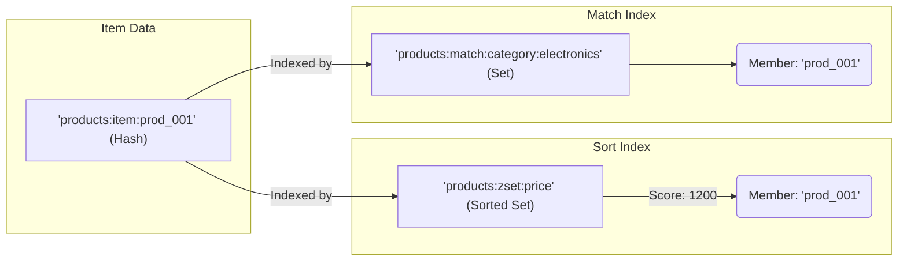

## Core Concepts: Data Modeling in Redis

`@microfox/db-upstash` abstracts away the low-level Redis commands, but understanding the underlying data structures it uses is key to leveraging the library effectively.

### `CrudHash`: Simple Object Storage

The `CrudHash` class uses a single Redis **Hash** for each item.

-   **Key:** `{keyPrefix}:{id}` (e.g., `sessions:sess_123`)
-   **Value:** A Redis Hash where each field in your object is a field in the hash.



**Pros:**
-   Very efficient for `get`, `set`, and `del` operations (O(1)).
-   Supports atomic partial updates of individual fields using `HSET`.

**Cons:**
-   **Inefficient for querying.** The `list` and `query` methods use the `SCAN` command to iterate over *all* keys matching the prefix. This is a slow, O(N) operation and should not be used on large datasets in production.

### `CrudStore`: Indexed Object Storage

`CrudStore` is more sophisticated. It uses a combination of Redis data structures to enable efficient querying.

1.  **Item Data (Hash):** Each item is still stored in its own Hash, just like with `CrudHash`.
    -   Key: `{keyPrefix}:item:{id}` (e.g., `products:item:prod_001`)

2.  **Sortable Indexes (Sorted Sets):** For each field in your `sortFields` config, a **Sorted Set** is created.
    -   Key: `{keyPrefix}:zset:{sortField}` (e.g., `products:zset:price`)
    -   Member: The item's ID (e.g., `prod_001`)
    -   Score: The numeric value of the `sortField` (e.g., `1200`)
    -   This allows for incredibly fast range queries (e.g., "get all products with price between 1000 and 1500") and sorting.

3.  **Matchable Indexes (Sets):** For each field in your `matchFields` config, a **Set** is created for *each unique value*.
    -   Key: `{keyPrefix}:match:{field}:{value}` (e.g., `products:match:category:electronics`)
    -   Members: The IDs of all items that have this exact field-value pair.
    -   This allows for fast lookups of all items with a specific property.



When you call `set`, `update`, or `del` on a `CrudStore`, it uses a Redis Pipeline to update the item's Hash and all of its associated indexes in a single, atomic batch operation.

## Indexing Strategy and Best Practices

-   **Choose `sortFields` wisely:** Only use fields that are numbers (like timestamps, prices, or counts) and that you will need to sort by or query within a range.
-   **Use `matchFields` for low-cardinality data:** "Cardinality" refers to the number of unique values. Fields like `category`, `status`, or `type` are excellent candidates for `matchFields`. Avoid using them on high-cardinality data like `email` or `username`, as this would create a huge number of individual Set keys.
-   **Keep your `id` unique and simple:** The `id` is the core of your item and is used as the member in all indexes.
-   **Plan your `keyPrefix`:** Use a descriptive prefix to create a clean namespace for your data within Redis (e.g., `users`, `products`, `articles`).

## Error Handling

The library provides custom error types that extend the base `Error` class, allowing you to handle specific failure scenarios gracefully.

-   **`DbUpstashError`**: The base error class for this library.
-   **`ConfigurationError`**: Thrown if there is an issue with the setup (e.g., missing Redis client).
-   **`ItemNotFoundError`**: Thrown by `update` or `del` if the target item doesn't exist.
-   **`InvalidFieldError`**: Thrown by `update` if you attempt to change an item's `id` or provide a non-numeric value for a `sortField`.

```typescript
import { ItemNotFoundError } from '@microfox/db-upstash';

try {
  await userStore.update('non-existent-user', { name: 'New Name' });
} catch (error) {
  if (error instanceof ItemNotFoundError) {
    // Handle the specific case of the user not being found
    console.error('Could not update user because they do not exist.');
  } else {
    // Handle other potential errors
    console.error('An unexpected error occurred:', error);
  }
}
```

## `Paginator`: Tracking Long-Running Jobs

The `Paginator` class is a utility for managing the state of a multi-step or long-running process. It's not for paginating data from a list, but for tracking the progress of something like a data import, a report generation, or a multi-page scraping job.

It stores a simple state object in Redis and provides methods to update it atomically.

### Use Case Example
Imagine you're indexing a large number of documents.
```typescript
import { Paginator } from '@microfox/db-upstash';
import { redis } from './lib/redis';

// Each indexing job gets a unique ID
const paginator = new Paginator<{ documentsProcessed: number, totalDocuments: number }>(redis, 'indexing-job-123');

async function runJob() {
  await paginator.startNewIndexing({ documentsProcessed: 0, totalDocuments: 1000 });

  for (let i = 1; i <= 1000; i++) {
    // ... process document i ...
    await paginator.updateIndexingStatus({ documentsProcessed: i });
  }

  await paginator.completeIndexing();
}
```
You can then check the status from another process:
```typescript
const status = await paginator.getCurrentStatus();
console.log(`${status.progress.documentsProcessed} / ${status.progress.totalDocuments} processed.`);
```
This is useful for building resumable jobs, monitoring progress from a UI, and handling failures gracefully.
