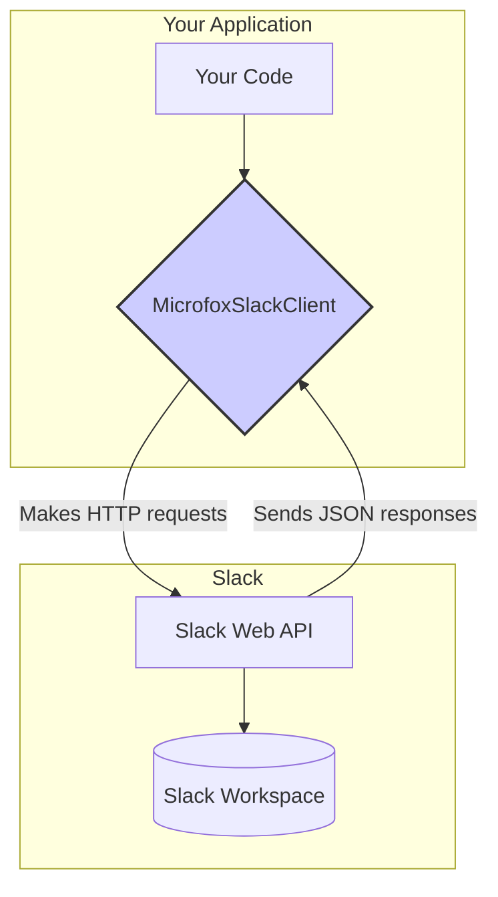

## A Modern SDK for the Slack API

`@microfox/slack` is a comprehensive TypeScript SDK that makes interacting with the Slack API simple, predictable, and type-safe. It's designed to provide an excellent developer experience, abstracting away the complexities of HTTP requests and providing a clean, intuitive interface for all of Slack's methods.

### What Problem Does It Solve?
Interacting with the Slack API directly requires developers to manage HTTP clients, handle authentication, construct complex request bodies, and parse generic JSON responses. This is often tedious, error-prone, and lacks type safety.

This SDK solves these problems by providing:
-   **A Simple, Method-Based Interface:** No more dealing with raw `fetch` calls. Methods like `client.chat.postMessage()` are clear and discoverable.
-   **Strong Type Safety:** All API methods and responses are fully typed, catching potential bugs at compile-time and enabling editor autocompletion.
-   **Built-in Authentication:** The client handles attaching your bot token to every request automatically.
-   **A Consistent Developer Experience:** Provides a stable and well-documented surface for all your Slack integrations.

### Who Is This For?
This package is for any developer building a Node.js application that needs to integrate with Slack. Common use cases include:
-   Building custom Slack bots and applications.
-   Sending notifications from your services to Slack channels.
-   Automating team workflows, such as creating channels or inviting users.
-   Syncing data between your application and your Slack workspace.

### High-Level Architecture
The SDK acts as a structured client that sits between your application and the official Slack Web API. You instantiate the client, and it handles the communication and data transformation for you.

### Key Features
-   **Complete API Coverage:** Provides methods for all of Slack's Web API namespaces (`chat`, `users`, `conversations`, `files`, etc.).
-   **Fully Typed:** Written in TypeScript for end-to-end type safety.
-   **Intuitive and Discoverable:** The client's structure (`client.namespace.method`) mirrors the official Slack API documentation, making it easy to find the function you need.
-   **Lightweight:** A thin, modern wrapper with minimal dependencies.

This documentation provides a comprehensive **[Getting Started](/micro-sdks/slack/getting-started)** guide, an in-depth look at the package's **[Foundation](/micro-sdks/slack/foundation)**, and a detailed API Reference to help you get the most out of `@microfox/slack`.
