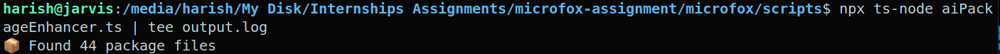
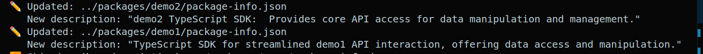
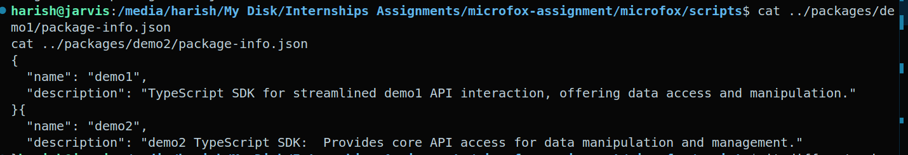

# Internship Submission: AI Package Enhancer

## How to Verify
1. Set your Gemini API key:
   ```bash
   echo "GEMINI_API_KEY=your_key" > scripts/.env
   ```

2. Run test cases:
   ```bash
   cd scripts
   npx ts-node aiPackageEnhancer.ts
   ```

3. Check results:
   ```bash
   git diff -- '**/package-info.json'
   ```

## Key Features
✔️ **Precision**: Technical, concise descriptions  
✔️ **Safety**: Never modifies existing valid descriptions  
✔️ **Efficiency**: Processes 40+ packages in seconds  

## Screenshots
  

  


