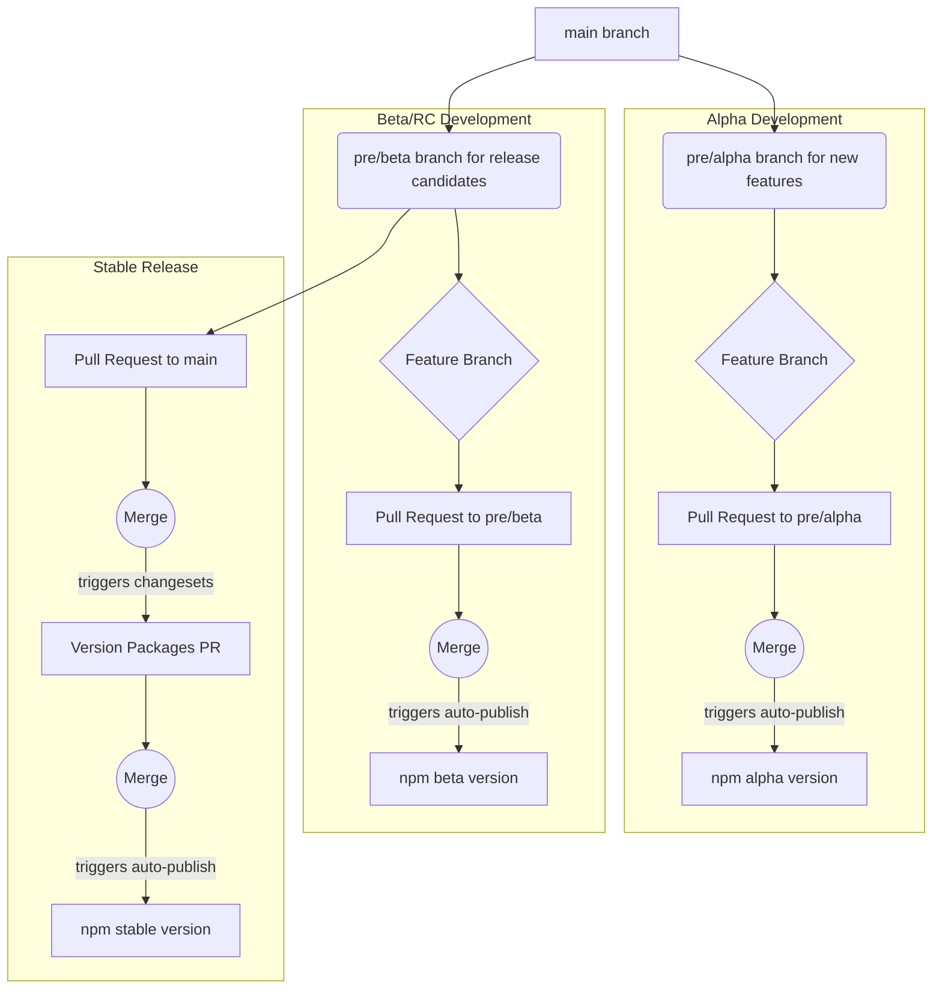

# A Beginner's Guide to Pre-releases (Alpha & Beta)

This guide explains our pre-release workflow. Pre-releases allow us to test new features before they are available to everyone in a stable release.

We have two types of pre-releases:
- **`alpha`**: For brand-new, experimental features. Expect bugs!
- **`beta`**: For features that are almost ready for a stable release but need final testing.

---

## The Big Picture: Our Branching Workflow

Our release process uses specific branches to keep things organized and stable. Here is a visual overview of how code flows from a feature branch to a final release.



---

## Part 1: How to Contribute to a Pre-release

Follow these steps if you are a developer wanting to work on a feature that will be part of a pre-release.

### Step 1: Create Your Feature Branch

Your first step is to create a new branch for your work. You must branch from either `pre/alpha` or `pre/beta`.

> **Important:**
> - Use `pre/alpha` for new, unstable features.
> - Use `pre/beta` for features that are nearly stable and are candidates for the next official release.

```bash
# To work on an ALPHA feature:
# 1. Get the latest from the alpha branch
git checkout pre/alpha
git pull origin pre/alpha

# 2. Create your new feature branch from it
git checkout -b your-feature-name
```

```bash
# To work on a BETA feature:
# 1. Get the latest from the beta branch
git checkout pre/beta
git pull origin pre/beta

# 2. Create your new feature branch from it
git checkout -b your-feature-name
```

> **First time?** If the `pre/alpha` or `pre/beta` branch doesn't exist yet, you can create it from `main`:
> ```bash
> git checkout main
> git pull origin main
> git checkout -b pre/alpha
> git push -u origin pre/alpha
> ```

### Step 2: Do Your Work & Add a Changeset

After you've made your code changes, you need to add a "changeset". A changeset is a small file that explains what you've changed. It's how our system knows what to include in the release notes.

```bash
# Run this command in your terminal
npm run changeset
```

Follow the command-line prompts. It will ask you which packages you changed and what kind of change it was (a patch, minor, or major change).

### Step 3: Open a Pull Request

Once your work is done and you've added a changeset, open a pull request.

- If your feature branch was based on `pre/alpha`, your PR must target `pre/alpha`.
- If your feature branch was based on `pre/beta`, your PR must target `pre/beta`.

### Step 4: Merge and Done!

Once your PR is reviewed and merged, the system takes over. A GitHub Action will automatically publish a new pre-release version to npm. For example, `my-package@1.2.3-alpha.0`.

You can then install this version for testing:
`npm install my-package@alpha`

---

## Part 2: How to Create a Stable Release

This part is for maintainers. Follow these steps when you are ready to "graduate" a pre-release (usually `beta`) into a stable, official release.

### Step 1: Manually Exit Pre-release Mode

This is the most important step. On the pre-release branch, you must run a command to signal that it is ready for a stable release.

> **Why is this step manual?**
> This is a crucial safety check. By running this command, you are explicitly confirming: "I have reviewed this pre-release, and it is stable enough to become the next official version." This prevents accidental releases.

```bash
# 1. Switch to the branch you want to release (usually pre/beta)
git checkout pre/beta
git pull origin pre/beta

# 2. Run the exit command
npm run changeset pre exit

# 3. Commit and push this change
git add .changeset/pre.json
git commit -m "chore: exit pre-release mode for beta"
git push
```

### Step 2: Open a Pull Request to `main`

Create a pull request from your pre-release branch (`pre/beta`) to the `main` branch. This PR bundles all the new features and fixes.

### Step 3: Merge to `main` and Finalize the Release

When the PR is merged into `main`, our release workflow does two things:

1.  It automatically creates a *new* pull request titled **"Version Packages"**. This PR updates all the package version numbers, removing the `-beta` suffix.
2.  Once you review and **merge the "Version Packages" PR**, it triggers the final step: publishing the new, stable version to npm for everyone to use.

Congratulations, you've successfully completed a release!
